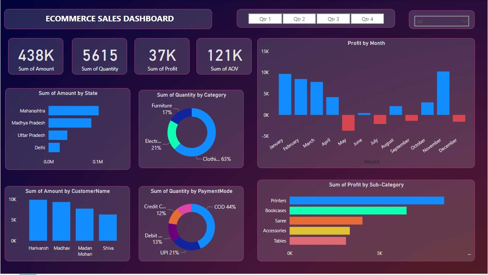

# Online Sales Dashboard Project

## Objective

The objective of this project is to assist the owner of the store in creating a dashboard to track and analyze their online sales across India.

## Project Learnings

### 1. Interactive Dashboard Creation
- Created an interactive dashboard to track and analyze online sales data.

### 2. Customization and Drill Down
- Used complex parameters to drill down in the worksheet and customization using filters and slicers.
- Created connections, joined new tables, and performed calculations to manipulate data and enable user-driven parameters for visualizations.

### 3. Customized Visualizations
- Utilized different types of customized visualizations including bar charts, pie charts, donut charts, clustered bar charts, scatter charts, line charts, area charts, maps, slicers, etc.

### Dashboard Visuals
- Sum of Amount, Quantity, Profit, and Average Order Value (AOV) cards.
- Bar chart of profit by month.
- Bar chart of sum of profit by subcategory.
- Pie chart of sum of quantity by payment mode.
- Bar chart of sum of amount by state.
- Bar chart of sum of amount by customer name.
- Pie chart of sum of quantity by category.

### Dashboard Screenshot

